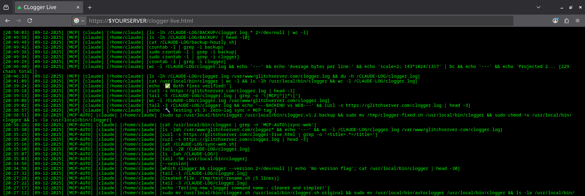
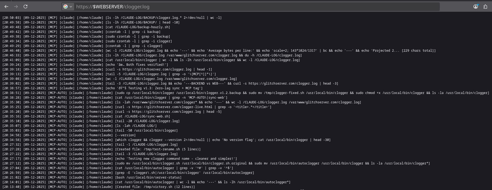

# clogger - Dead-Simple MCP Audit Logging



**Transparent, real-time audit logging for MCP (Model Context Protocol) operations with instant web accessibility.**

Built in 56 lines of bash. Zero dependencies beyond standard Linux tools.

## ✨ Features

- 🔍 **Transparent Logging** - Wrap any command with `clogger "command"` - zero manual logging
- 🧠 **Smart Summarization** - Heredocs and long commands automatically condensed
- 🌐 **Instant Web Sync** - View logs at `https://yourdomain.com/clogger.log` with zero lag
- ⚡ **Live Updates** - Auto-refreshing web dashboard updates every 300ms
- 💾 **Automated Backups** - Hourly snapshots with 24-hour retention
- 🎯 **Exit Code Preservation** - Non-intrusive, doesn't break error handling
- 📊 **Reverse Chronology** - Newest entries at top (via `tac`)

## 📸 Screenshots

### Raw Log View


### Live Dashboard


## 🚀 Quick Start

```bash
git clone https://github.com/GlitchLinux/clogger.git
cd clogger
sudo ./install-clogger.sh
```

Configure your domain and start logging!

## 📖 Full Documentation

See complete installation, usage, and configuration guide below.

---

## Installation

### Automated
```bash
sudo ./install-clogger.sh
```

### Manual
See [Manual Installation](#manual-installation) section.

## Usage

```bash
# Wrap any command
clogger "ls -la /home"

# Pipelines work
clogger "cat file.txt | grep error"

# Heredocs auto-summarized
clogger "cat > script.sh <<'EOF'
#!/bin/bash
echo 'test'
EOF"
```

## Log Format

```
[HH:MM:SS] [DD-MM-YYYY] [MCP] [user] [/directory] [command]
```

## Web Access

- **Raw logs:** `https://yourdomain.com/clogger.log`
- **Live dashboard:** `https://yourdomain.com/clogger-live.html`

## Performance

- 143KB at 1,300 entries
- ~2.1MB at 20,000 entries  
- <10ms browser load time
- ~5-10ms logging overhead

## License

MIT License - See [LICENSE](LICENSE)

---

## Detailed Documentation

<details>
<summary>📋 Prerequisites</summary>

- Linux (Debian/Ubuntu tested)
- Apache2 or Nginx
- Bash 4.0+
- Standard utils: `tac`, `bc`, `cron`

</details>

<details>
<summary>🔧 Manual Installation</summary>

1. **Create log directory:**
```bash
sudo mkdir -p /CLAUDE-LOG/BACKUP
sudo chown $USER:$USER /CLAUDE-LOG
sudo chmod 777 /CLAUDE-LOG
```

2. **Install clogger:**
```bash
sudo cp scripts/clogger /usr/local/bin/
sudo chmod +x /usr/local/bin/clogger
```

3. **Install sync script:**
```bash
cp scripts/sync-web.sh /CLAUDE-LOG/
chmod +x /CLAUDE-LOG/sync-web.sh
# Edit to set WEB_FILE="/var/www/YOUR_DOMAIN/clogger.log"
```

4. **Install backup script:**
```bash
cp scripts/backup-hourly.sh /CLAUDE-LOG/
chmod +x /CLAUDE-LOG/backup-hourly.sh
```

5. **Set up cron:**
```bash
crontab -e
# Add: 0 * * * * /CLAUDE-LOG/backup-hourly.sh >> /CLAUDE-LOG/cron-backup.log 2>&1
```

6. **Deploy web dashboard:**
```bash
sudo cp scripts/clogger-live.html /var/www/YOUR_DOMAIN/
# Edit to update fetch URL
sudo chown www-data:www-data /var/www/YOUR_DOMAIN/clogger*
sudo chmod 644 /var/www/YOUR_DOMAIN/clogger*
```

</details>

<details>
<summary>🧠 Smart Summarization</summary>

**Heredocs:**
```
Input:  cat > file.py <<EOF [500 lines] EOF
Output: Created file: file.py (500 lines)
```

**Long commands:**
```
Input:  [300 char command]
Output: [first 150 chars... [300 chars total]]
```

**sed operations:**
```
Input:  sed -i 's/old/new/g' config.conf
Output: Modified with sed: config.conf
```

</details>

<details>
<summary>⚙️ Configuration</summary>

### Backup Retention
Edit `/CLAUDE-LOG/backup-hourly.sh`:
```bash
# Keep 24 backups (change +25)
ls -t clogger.log.* | tail -n +25 | xargs rm -f
```

### Sync Frequency
Edit `/usr/local/bin/clogger`:
```bash
# Instant (current)
/CLAUDE-LOG/sync-web.sh &>/dev/null

# Async (background)
/CLAUDE-LOG/sync-web.sh &>/dev/null &
```

### Log Location
Edit `/usr/local/bin/clogger`:
```bash
echo "$TIMESTAMP [MCP] [claude] [$(pwd)] [$LOG_CMD]" >> /YOUR/PATH/clogger.log
```

</details>

<details>
<summary>🔒 Security</summary>

### Restrict Web Access
Apache `.htaccess`:
```apache
<Files "clogger.log">
    Require ip 192.168.1.0/24
</Files>
```

### HTTP Auth
```bash
htpasswd -c /etc/apache2/.htpasswd admin
```

### Pattern Redaction
Add to `clogger`:
```bash
LOG_CMD=$(echo "$LOG_CMD" | sed 's/password=[^ ]*/password=REDACTED/g')
```

</details>

<details>
<summary>🐛 Troubleshooting</summary>

### Not logging
```bash
which clogger
ls -la /CLAUDE-LOG/clogger.log
clogger "echo test" && tail -1 /CLAUDE-LOG/clogger.log
```

### Web sync failed
```bash
/CLAUDE-LOG/sync-web.sh
ls -la /var/www/YOUR_DOMAIN/clogger.log
sudo chown www-data:www-data /var/www/YOUR_DOMAIN/clogger.log
```

### Backups not running
```bash
crontab -l | grep backup
/CLAUDE-LOG/backup-hourly.sh
ls -la /CLAUDE-LOG/BACKUP/
```

</details>

## 📊 File Structure

```
/CLAUDE-LOG/
├── clogger.log
├── sync-web.sh
├── backup-hourly.sh
└── BACKUP/clogger.log.*

/usr/local/bin/clogger

/var/www/YOUR_DOMAIN/
├── clogger.log
└── clogger-live.html
```

## 🚀 Roadmap

- [ ] Multi-user support
- [ ] Sensitive data redaction patterns
- [ ] JSON output format
- [ ] systemd journal integration
- [ ] Search/filter UI
- [ ] Retention policies
- [ ] Webhook notifications

## 🤝 Contributing

Fork → Branch → Test → PR

## 📞 Support

- [Issues](https://github.com/GlitchLinux/clogger/issues)
- [Discussions](https://github.com/GlitchLinux/clogger/discussions)

---

**Made with ❤️ by [GlitchLinux](https://github.com/GlitchLinux)**

*"Because knowing what your AI did shouldn't require an enterprise logging solution."*
